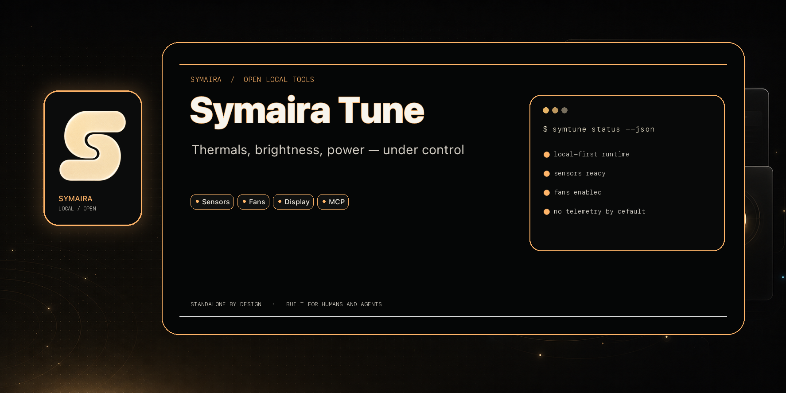

# symaira-tune

[](https://github.com/danieljustus/symaira-tune/actions/workflows/ci.yml)
[](https://github.com/danieljustus/symaira-tune/releases/latest)
[](LICENSE)



> Tune your Mac — thermals, brightness, power — from the CLI and for AI agents.

`symtune` is a small, native macOS utility that reads your Mac's thermal, power,
and display state and lets you tune it: extended/EDR brightness, software dimming,
**fan speed**, and **battery charge limits**. Everything is exposed **both** as a
CLI and as an **MCP server**, so AI agents can observe and adjust the machine —
e.g. "this render is running hot, ramp the fans and dim the screen."

Part of the [Symaira](../ECOSYSTEM.md) family of AI-agent-native macOS tooling
(Apache-2.0).

> **Status: v0.9.1 core + standalone menu-bar app.** The current release includes
> fan control and battery charge limiting directly in the open core. SMC writes
> require `sudo`. Homebrew installs both the app and the CLI from the generated
> cask (`brew install danieljustus/tap/symtune`).

## Why not the Mac App Store?

Fan/SMC control, DDC, and shipping a global `symtune` CLI for agents are
incompatible with the App Store sandbox. `symtune` is built for **notarized
direct distribution / Homebrew cask** (the same channel as `symaira-terminal`).

## Install

The recommended way is the Homebrew cask, which installs both the `symtune`
CLI and the menu-bar app:

```bash
brew install danieljustus/tap/symtune
```

Prebuilt binaries (DMG with `SymairaTune.app` and the CLI) are also attached
to each [release](https://github.com/danieljustus/symaira-tune/releases/latest).

### Install from source (alternative)

```bash
git clone <repo-url> && cd symaira-tune
swift build -c release
.build/release/symtune doctor
```

## Standalone menu-bar app

The app is a first-class standalone artifact, not a Hub-only component. From a
macOS checkout with full Xcode and XcodeGen installed:

```bash
brew install xcodegen
make build-app
open build/app/SymairaTune.app
make smoke-app
```

The release DMG contains `SymairaTune.app` and the CLI binary. The app uses the
same `TuneController` and `SafetyPolicy` as the CLI and MCP surfaces. See
[`docs/manual-app-verification.md`](docs/manual-app-verification.md) for the
real-host control and restore-on-exit checklist.

The menu-bar popover opens with a live CPU / memory / thermal strip under the
title, then two labelled groups: **controls** (display brightness/dim/warmth,
keep-awake, fan) and **system** (top processes, system status, metric history
with sparklines, displays). Choose which cards are visible in the preferences
view; the selection is persisted in `~/.config/symtune/config.toml` under
`[popover] cards = [...]` (an explicit empty list shows an empty panel; a card
added by a later release joins a non-empty list rather than staying hidden).

**Top Processes** answers "what is making this Mac hot/slow?" with one click:
expand the card and it ranks processes by CPU or memory, click a row for its
PID, thread count and the other resource. It only samples while expanded and
visible, so a collapsed card costs nothing. Processes owned by another user
(root) are counted but not readable without elevation — the card says so rather
than quietly omitting them.

### Extended ("beyond 100%") brightness

The single **Beyond Normal** slider is centred on "the display as macOS drives
it": left of centre is the software dim overlay, right of centre is extended
brightness. Extended brightness needs two things macOS only gives together — a
1×1 on-screen EDR layer to make the system grant headroom above SDR white, and a
gamma-table boost that lifts what is already on screen into that headroom. The
boost is always clamped to the headroom the display actually grants, and the card
reports when it is waiting for HDR or was limited, instead of leaving a slider
that looks effective and is not.

If "Brighter" keeps reporting that it is waiting, check that **High Dynamic
Range** is enabled for the display in System Settings › Displays: with HDR off,
macOS grants no headroom to any application and nothing can exceed 100% SDR.

## CLI

Every read command accepts `--json`. `doctor`, `sensors`, `battery`,
`displays`, `permissions`, and `metrics` only ever have a machine-readable
form — they always print JSON, and `--json` there is a no-op accepted for
consistency. The rest (`status`, `history`, `processes`, `ai-usage`) print a
human-readable table by default and switch to JSON when `--json` is given.

```text
symtune doctor                        # capabilities, host info, recommendations (JSON)
symtune status                        # current override/session status
symtune history                       # recent applied changes
symtune sensors                       # thermal pressure + temps/fan RPM via AppleSMC (JSON)
symtune battery                       # charge %, cycles, capacity, health, condition (JSON)
symtune displays                      # displays + EDR headroom / extended-brightness capability (JSON)
symtune permissions                   # permission & SMC write status (JSON)
symtune metrics                      # system metrics: CPU, memory, disk, network (JSON)
symtune processes [--sort cpu|memory] [--limit N]
                                     # processes using the most CPU / memory
symtune ai-usage                     # AI subscription/token usage per provider (read-only)
symtune awake [--display] [--seconds N]   # prevent idle sleep (like caffeinate)
symtune brightness get                # read built-in display brightness (0.0–1.0)
symtune brightness set <0.0-1.0>      # built-in display brightness
symtune extbright set <1.0-1.6>       # extended brightness (EDR trigger + gamma boost)
symtune dim set <0.15-1.0>            # software dim overlay
symtune dim reset                     # remove all dim overlays
symtune warmth set <0.0-1.0>          # color temperature warmth (gamma)
symtune warmth reset                  # reset warmth to neutral
symtune fan set <0.0-1.0>             # fan speed fraction (requires sudo)
symtune fan auto                      # return fans to firmware automatic control
symtune battery-limit set <50-100>    # hold charge at target percent (requires sudo)
symtune battery-limit clear           # re-enable charging (requires sudo)
symtune restore                       # restore all overrides to defaults
symtune profile save <name>           # save current settings as a profile
symtune profile load <name>           # apply a saved profile
symtune profile list                  # list saved profiles
symtune profile delete <name>         # delete a saved profile
symtune serve                         # run the MCP server over stdio
symtune version [--check-for-updates] # print version (optionally check GitHub releases)
```

Example:

```bash
$ symtune battery
{
  "current_capacity_percent": 82,
  "cycle_count": 93,
  "health_percent": 97,
  "present": true,
  "temperature_celsius": 30.6,
  ...
}

$ sudo symtune fan set 0.5
$ sudo symtune battery-limit set 80
```

> **Why `health_percent` and Apple's "Maximum Capacity" differ.** `health_percent`
> is symtune's own estimate, derived from the `AppleSmartBattery` IORegistry
> keys (`AppleRawMaxCapacity` / `DesignCapacity`). It is unrounded and moves a
> percentage point or two day to day. `apple_maximum_capacity_percent` and
> `apple_condition` are Apple's own figures from `system_profiler
> SPPowerDataType` — whole-percent and steady, matching System Settings. The
> two numbers legitimately disagree; when both are present you can compare them
> directly instead of wondering which tool is wrong. The Apple fields are
> reported as absent when the block cannot be read or parsed (older macOS, no
> battery, localized output), and the `system_profiler` read is cached so it
> never runs on a refresh loop.

## MCP integration

Register `symtune serve` with any MCP-capable agent host (Claude Desktop, Cursor,
OpenCode, …). Example fragment:

```json
{
  "mcpServers": {
    "symtune": {
      "command": "/absolute/path/to/symtune",
      "args": ["serve"]
    }
  }
}
```

Tools exposed: `get_capabilities`, `get_sensors`, `get_battery`, `list_displays`,
`get_system_metrics`, `get_top_processes`, `get_ai_usage`, `keep_awake`,
`get_brightness`, `set_brightness`, `set_extended_brightness`,
`set_warmth`, `reset_warmth`, `set_dim`, `reset_dim`, `set_fan`,
`set_charge_limit`, `clear_charge_limit`, `restore`, `save_profile`,
`load_profile`, `list_profiles`, `delete_profile`, `get_status`, `get_history`.

### MCP safety

By default, the MCP server exposes the full tool set above, including the
write tools (`set_brightness`, `set_fan`, `set_charge_limit`, `restore`, …) —
an agent host that connects with no further configuration gets read/write
access. To restrict a host to observation only, opt in to read-only mode with
either the environment variable or the config-file equivalent:

```bash
SYMTUNE_MCP_MODE=read-only symtune serve
```

```toml
# ~/.config/symtune/config.toml
[mcp]
mode = "read-only"
```

Read-only mode filters every write tool out of the `tools/list` registry
before the host ever sees them — an agent literally cannot discover or call
`set_brightness`, `set_fan`, `set_charge_limit`, etc. Read tools (`get_battery`,
`get_sensors`, `list_displays`, …) stay available. `"full"` is the default; you
must opt in to `"read-only"` explicitly. Run `symtune permissions` to confirm
which mode is active — it reports `mcp_mode` and a human-readable note
(`"MCP server mode is read-only (write tools hidden from tools/list)."`).

## Safety

Every active write path is bounded by `SafetyPolicy`. Fan and charge-limit
commands write to the Apple SMC and require `sudo`; they are clamped to safe
ranges, never disable firmware thermal protection, and restore the original SMC
values on normal teardown or `SIGINT`/`SIGTERM`. Temporary display overrides are
restored in the same way. Read the full, implementation-grounded model in
[`SAFETY_AUDIT.md`](SAFETY_AUDIT.md). See also [`NOTICE`](NOTICE) and
[`docs/commercial-boundary.md`](docs/commercial-boundary.md).

## Contributing

Contributions are welcome! See [CONTRIBUTING.md](CONTRIBUTING.md) for the build,
test, and lint workflow, branch and PR expectations, and where to ask questions.
All participants are expected to follow the [Code of Conduct](CODE_OF_CONDUCT.md).

## License

Apache-2.0 © 2026 Daniel Justus. Inspired by Macs Fan Control and BrightIntosh (no code
from either).
